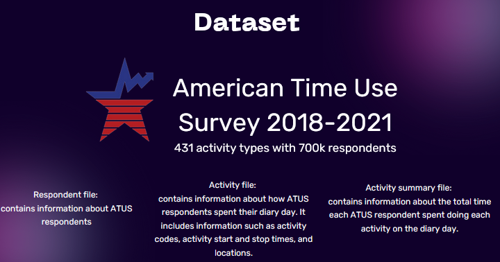
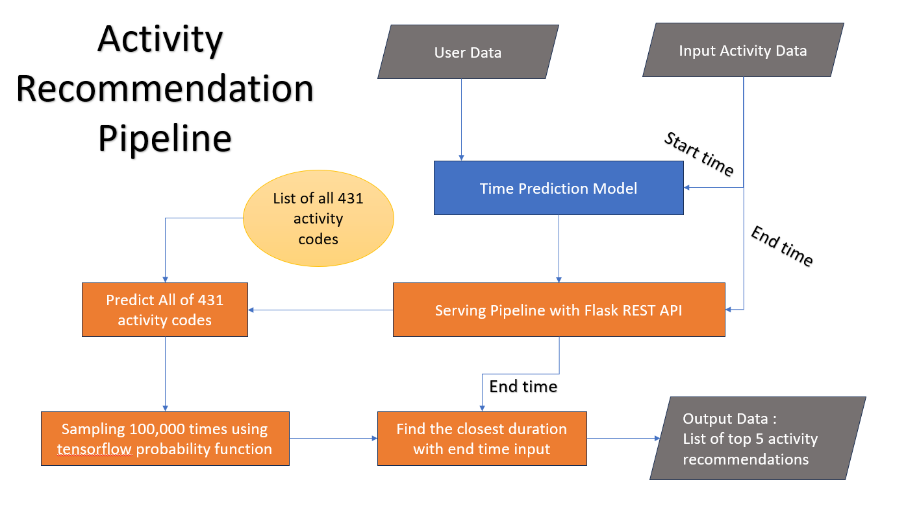

# Machine Learning repository of Bangkit Capstone Project "Calendivity"

# Dataset
## American Time Use Survey (ATUS) Dataset

<h3> Source : https://www.bls.gov </h3>
This dataset measures the amount of time people spend doing various <b>activities</b>, such as paid work, childcare, volunteering, and socializing. We analyzed the datasets within the years from 2017 until 2020. There are several dataset files for each year, we only use three of the most important datasets :  
1. Respondent File Dataset : The respondents' biodata and social circumstances 
2. Activity File Dataset : list of activities done by the respondents in one day 
3. Summary File Dataset : Summary of each respondent corresponds to the activities done by them in one day.
  
The dataset contains more than 450 unique activity codes. After processing the data we realize there are similar activities overlapping each other (e.g Eating Lunch and Eating Breakfast). Thus, we decided to cut out some of the codes into 431 unique activity codes.

# Machine Learning Models
We created two separate model for serving purposes. The first model is responsible for producing the activity codes from it's input name. Meanwhile, The second model is serving for both the Activity Difficulty Prediction and Activity Recommendation. We utilize Flask REST API which run in Google Cloud Platform to serve the model in production.
  
Here is the illustration of how the machine learning system works 

## 1. Time Prediction Model

This is our main machine learning model which is able to perform multitask learning. It consists of a special TensorFlow Probability's DistributionLambda Layer as the last layer. DistributionLambda utilize the power of Probabilistic Bayesian Statistics to outputs a distribution object instead of a real consistent number. We set the DistributionLambda to output a Gaussian Normal Distribution which means it calculates the Mean and the Standard Deviation as the building blocks of the output distribution.

This model predict the time duration of activity instead of directly estimating the activity difficulty. It calculates the difference between the end time input and the generated output to be able to compute the Difficulty and Exp Gain, as well as the Activity Recommendation. For the details, please kindly check the previous pipeline illustration.

### Customized Loss Function

We utilized the Statistical Distribution property of the output from DistributionLambda which enable us to compute the Negative Log Likelihood between the generated distribution and the true label. In order to stabilizing the loss, We also added Huber Loss to further improve the model.

## 2. Text Embedding Model

 
PyTorch Transformers Embedding Model (Customized Pre-trained Model from HuggingFace). We added 431 layers at the end of the model which corresponds to each activity code. We finetuned the model with list of activities of each activity codes which is provided in the www.bls.gov website. We used Categorical Crossentopy loss funtion per epoch (instead of per batch) which made the loss converge faster.

## 3. Machine Translation EN - ID Model [On Development]
PyTorch Transformers Machine Translation Model. This is a Pre-trained Model from HuggingFace. We are still configuring this model due to several bugs in the application deployment. In some cases, the model generates random texts instead of doing translation and it could takes more than 1 minutes for the model to produce the output because of this bug.

# Colab / Notebook Experiments
Link Colabs (contrib : Jonathan): 
1. https://colab.research.google.com/drive/1sFS_ere-aG_7ZjWyioLwXV0bQiOORfMB - Model Finalization with HuggingFace pre-trained model
2. https://colab.research.google.com/drive/1rkZeDkZmjOKMgxImiWPOLkVIjYD9A4g7?usp=sharing - EDA & Model Experiments (Trial & Error)

Link Colabs (contrib : Segaf):  
1. https://colab.research.google.com/drive/1MYRp3bjejf__cEIbTDOblfsY5Ja2G5-X?usp=sharing - first generation model and processing csv file
2. https://colab.research.google.com/drive/1CHHrYY9ryU8vmxWvEuOGVxeBwHqWcT-D?usp=sharing - model optimization of the first and the second generation.

Link Colabs (contrib : Fairuzi):
1. https://colab.research.google.com/drive/1Pr80JRPQ6a7IJ_1wh65Hz2IXoclZSzBV?usp=sharing - first generation data preprocessing and transformation
